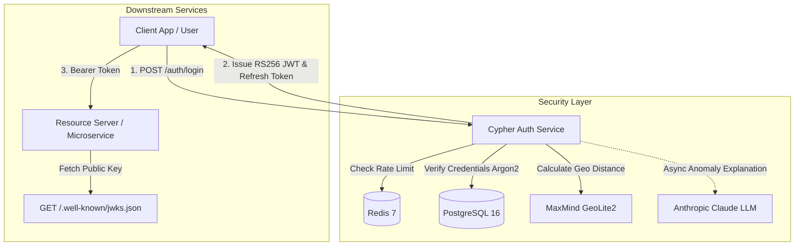

# Cypher Auth Service

[](https://openjdk.org/)
[](https://spring.io/projects/spring-boot)
[](https://spring.io/projects/spring-security)
[](https://www.postgresql.org/)
[](https://redis.io/)
[](https://www.docker.com/)
[](LICENSE)

**Cypher** is a production-grade, centralized identity and authentication (OAuth2/OIDC compatible) microservice designed as a reusable security foundation for distributed systems and microservices architectures. 

It unifies authentication, token issuance, and access delegation across client applications using asymmetric cryptography (RS256) and standard JWKS. Cypher implements enterprise-level security patterns including sliding-window rate limiting, rotating refresh tokens, and real-time impossible-travel anomaly detection augmented with LLM-powered incident explanations.

---

## Key Features

- **Asymmetric JWT Signing (RS256 & JWKS)**: Tokens are signed using an RSA private key stored in a PKCS12 keystore. Downstream microservices verify tokens autonomously via the public `/.well-known/jwks.json` endpoint without sharing sensitive secrets.
- **Rotating Refresh Tokens**: Mitigates token theft through single-use refresh tokens stored as SHA-256 hashes. Automatic invalidation and rotation occurs on each renewal.
- **Redis-Backed Rate Limiting**: High-throughput sliding window rate limiting on login attempts per IP and account, neutralizing brute-force and credential-stuffing attacks.
- **Impossible Travel Detection**: Computes geographical displacement and speed between consecutive logins using MaxMind GeoLite2. Speeds exceeding physical feasibility (>900 km/h) trigger security anomaly alerts.
- **AI-Powered Threat Summaries**: Anomalous logins asynchronously trigger Anthropic Claude to generate concise, human-readable threat explanations stored in audit logs.
- **State-of-the-Art Password Hashing**: Utilizes **Argon2id**, the winner of the Password Hashing Competition (PHC), for resistance against GPU/ASIC-assisted attacks.
- **Ephemeral Integration Testing**: Comprehensive integration test suite using **Testcontainers** (spinning up isolated PostgreSQL and Redis containers).

---

## System Architecture



---

## Tech Stack

| Component | Technology | Description |
| :--- | :--- | :--- |
| **Language & Framework** | Java 21, Spring Boot 3 | Core application framework and modern runtime |
| **Security & Auth** | Spring Security, JJWT, BouncyCastle | Security filters, Argon2 password hashing, RS256 JWT generation |
| **Relational Database** | PostgreSQL 16, Spring Data JPA | Relational storage for users, refresh tokens, and login audit logs |
| **In-Memory Store** | Redis 7, Spring Data Redis | High-speed atomic counters for rate limiting |
| **Geolocation** | MaxMind GeoLite2 City | Offline binary database for IP-to-coordinates resolution |
| **Artificial Intelligence** | Anthropic Claude API | Asynchronous LLM integration for security anomaly explanations |
| **Containerization** | Docker, Docker Compose | Multi-stage reproducible container builds |
| **Testing** | JUnit 5, AssertJ, Testcontainers | Automated integration testing with isolated containerized dependencies |

---

## Architectural Decisions & Design Patterns

### 1. Asymmetric (RS256) vs. Symmetric (HS256) Tokens
In microservices ecosystems, symmetric signing (HS256) requires every verifying service to share the same secret key. If a single service is compromised, the entire signing authority is lost. Cypher uses **RS256**: only Cypher holds the private key (inside `cypher-keystore.p12`), while resource servers fetch the public key via `/.well-known/jwks.json`.

### 2. Single-Use Refresh Token Rotation
Access tokens have a short lifespan (15 minutes). Refresh tokens are long-lived (7 days) but strictly single-use. When exchanged, the old refresh token is marked as revoked and replaced by a newly issued pair. Only SHA-256 hashes of refresh tokens are persisted to prevent token leakage from database backups.

### 3. High-Performance Rate Limiting with Redis
Login attempts are tracked in memory using Redis atomic operations (`INCR`, `EXPIRE`). This offloads transient counter writes from PostgreSQL and maintains millisecond-level response times during traffic spikes or distributed brute-force attacks.

### 4. Non-Blocking Anomaly Detection (`@Async`)
When a geographic jump is identified as impossible travel, calling an external LLM synchronously would degrade the login response latency. Cypher uses Spring's `@Async` worker pool to dispatch the LLM explanation request in the background, immediately returning the authentication token to the user and updating the audit log asynchronously.

---

## API Reference

### Public Endpoints

#### `POST /auth/register`
Creates a new user account.
- **Request Body:**
  ```json
  {
    "email": "user@example.com",
    "password": "SecurePassword123!"
  }
  ```
- **Response:** `201 Created`

#### `POST /auth/login`
Authenticates user credentials, evaluates rate limits, records audit metadata, and issues tokens.
- **Request Body:**
  ```json
  {
    "email": "user@example.com",
    "password": "SecurePassword123!"
  }
  ```
- **Response:** `200 OK`
  ```json
  {
    "access_token": "eyJhbGciOiJSUzI1NiIs...",
    "refresh_token": "a8fbc730...",
    "expires_in": 900
  }
  ```

#### `POST /auth/refresh`
Rotates a valid refresh token and issues a new access/refresh token pair.
- **Request Body:**
  ```json
  {
    "refresh_token": "a8fbc730..."
  }
  ```
- **Response:** `200 OK`

#### `GET /.well-known/jwks.json`
Exposes the JSON Web Key Set containing public RSA keys for downstream signature verification.
- **Response:** `200 OK`

---

### Protected Endpoints

#### `GET /auth/me`
Retrieves identity information for the authenticated user.
- **Headers:** `Authorization: Bearer <access_token>`
- **Response:** `200 OK`
  ```json
  {
    "id": "c1f7b884-6e1d-4d92-9e9b-9c76251b32ea",
    "email": "user@example.com",
    "role": "USER"
  }
  ```

---

## Getting Started

### Prerequisites

- **Java 21** or higher
- **Docker** & **Docker Compose**
- **Git**

### Installation & Local Setup

1. **Clone the repository:**
   ```bash
   git clone https://github.com/apugliano-git/Cypher-Auth-Service.git
   cd Cypher_Auth_Service
   ```

2. **Configure Environment Variables:**
   Copy the example environment configuration:
   ```bash
   cp .env.example .env
   ```
   Edit `.env` with your preferred passwords and optional Anthropic API key:
   ```env
   DB_PASSWORD=your_secure_db_password
   KEYSTORE_PASSWORD=replace_with_a_unique_keystore_password
   ANTHROPIC_API_KEY=your_anthropic_api_key_optional
   ```

3. **Verify Required Secrets:**
   Ensure the following binary assets exist in the `secrets/` directory. Keep `.env` and this directory readable only by the service account (`chmod 600 .env secrets/cypher-keystore.p12`); never commit either one. If the keystore or its password may have been exposed, generate a new key pair, deploy its JWKS key alongside the old one during the transition, then retire the old key.
   - `secrets/cypher-keystore.p12` (PKCS12 RSA Keystore)
   - `secrets/GeoLite2-City.mmdb` (MaxMind GeoLite2 Database)

4. **Launch with Docker Compose:**
   ```bash
   APP_UID=$(id -u) docker compose up -d --build
   ```
   This will spin up:
   - **PostgreSQL 16** on local port `5433` (internal `5432`)
   - **Redis 7**, internal to the Docker network only
   - **Cypher Auth Service** on port `8080`

5. **Verify Service Health:**
   ```bash
   curl http://localhost:8080/.well-known/jwks.json
   ```

---

## Running Automated Tests

Cypher includes an end-to-end integration test suite that leverages **Testcontainers** to spin up dedicated PostgreSQL and Redis containers automatically:

```bash
./mvnw test
```

---

## Project Structure

```
├── .github/                       # CI/CD workflows and configurations
├── secrets/                       # Local keystore and GeoLite2 database
│   ├── GeoLite2-City.mmdb
│   └── cypher-keystore.p12
├── src/
│   ├── main/
│   │   ├── java/com/augustopugliano/cypher/
│   │   │   ├── config/            # Security and filter configurations
│   │   │   ├── controller/        # REST controllers (Auth, JWKS)
│   │   │   ├── dto/               # Data Transfer Objects & Records
│   │   │   ├── exception/         # Custom exception hierarchy
│   │   │   ├── model/             # JPA Entities (User, RefreshToken, LoginAuditLog)
│   │   │   ├── repository/        # Spring Data JPA Repositories
│   │   │   ├── security/          # Security principal definitions
│   │   │   └── service/           # Core domain logic (JWT, RateLimit, Anomaly, LLM)
│   │   └── resources/
│   │       └── application.properties
│   └── test/                      # Testcontainers integration tests
├── docker-compose.yml             # Container orchestration
├── Dockerfile                     # Multi-stage container build
├── pom.xml                        # Maven dependencies & build lifecycle
├── LICENSE                        # MIT License
└── README.md                      # Project documentation
```

---

## License

This project is licensed under the **MIT License** - see the [LICENSE](LICENSE) file for details.

---

## Author

**Augusto Pugliano**
- GitHub: [@apugliano-git](https://github.com/apugliano-git)
- Email: [apug2004@gmail.com](mailto:apug2004@gmail.com)
